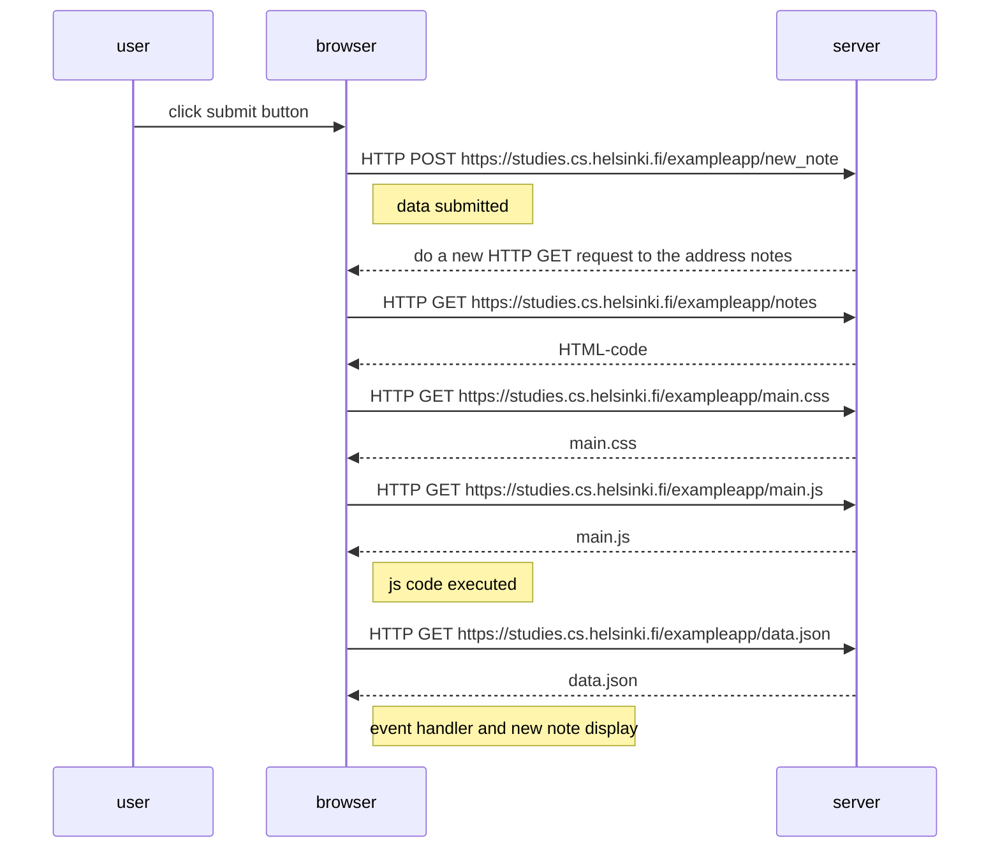

```mermaid

sequenceDiagram
    user ->> browser: click submit button 
    browser ->> server: HTTP POST https://studies.cs.helsinki.fi/exampleapp/new_note
    Note right of browser: data submitted
    server -->> browser: do a new HTTP GET request to the address notes
    browser ->> server: HTTP GET https://studies.cs.helsinki.fi/exampleapp/notes
    server -->> browser: HTML-code
    browser ->> server: HTTP GET https://studies.cs.helsinki.fi/exampleapp/main.css
    server -->> browser: main.css
    browser ->> server: HTTP GET https://studies.cs.helsinki.fi/exampleapp/main.js
    server -->> browser: main.js
    Note right of browser: js code executed
    browser ->> server: HTTP GET https://studies.cs.helsinki.fi/exampleapp/data.json
    server -->> browser: data.json
    Note right of browser: event handler and new note display

```